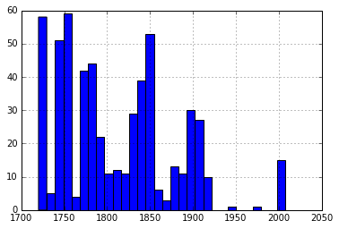

```python
import pandas as pd
import numpy as np
%matplotlib inline
```


```python
data = pd.read_csv('data/normalized/metadata.csv')
```


```python
# data count

len(data.index)
```


    1196


```python
# top 20 composers
data.groupby(by='composer')['composer'].count().sort_values(ascending=False)[:20]
```


    composer
    bach           223
    chopin         116
    mozart         114
    beethoven       96
    traditional     57
    schumann        52
    schubert        38
    haydn           37
    diabelli        36
    joplin          25
    grieg           22
    handel          21
    clementi        21
    liszt           20
    czerny          19
    tchaikovsky     19
    burgmuller      19
    verdi           19
    debussy         17
    scriabin        17
    Name: composer, dtype: int64


```python
# original musical keys
data.groupby(by='key')['key'].count()
```


    key
    A major      50
    A- major     37
    B major      17
    B- major     69
    C major     116
    C# major     35
    D major      78
    E major      35
    E- major     52
    F major      87
    F# major     24
    G major      98
    a minor      75
    b minor      25
    b- minor     16
    c minor      52
    c# minor     33
    d minor      73
    e minor      44
    e- minor     16
    f minor      33
    f# minor     18
    g minor      60
    g# minor     15
    Name: key, dtype: int64


```python
data['year'].hist(bins=30, )
```


    <matplotlib.axes._subplots.AxesSubplot at 0x7f127c165358>





```python
data.groupby(by='period')['period'].count()
```


    period
    baroque        249
    classicism     253
    folk            58
    jazz            26
    modern          54
    romanticism    412
    Name: period, dtype: int64


```python
data.groupby(by='musical_form')['musical_form'].count()
```


    musical_form
    ballad         5
    canon          5
    etude         50
    fantasia      16
    fugue         57
    march         13
    mazurka       25
    nocturne       7
    polonaise      5
    prelude      139
    rag           17
    rhapsod        6
    rondo          6
    sonata       243
    sonatina      20
    song          27
    suite         27
    technique     20
    valse          5
    Name: musical_form, dtype: int64


